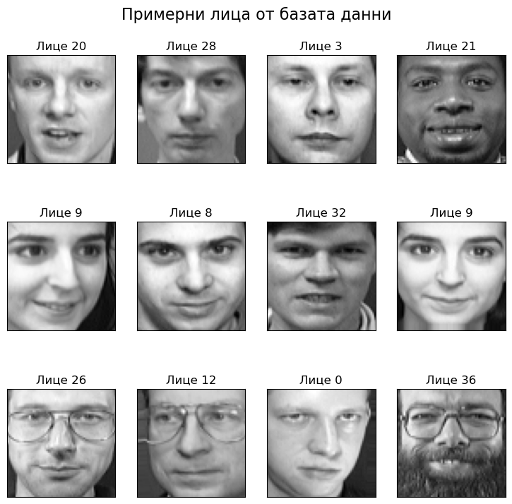
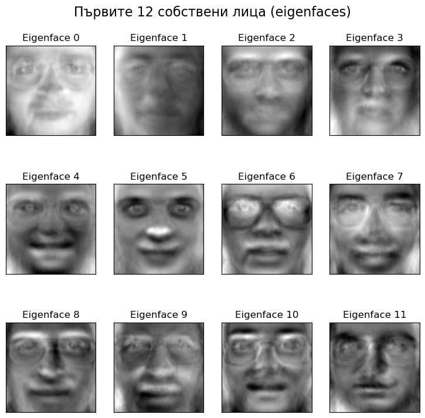
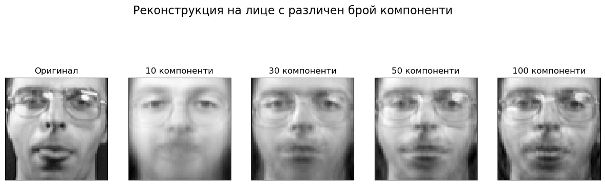
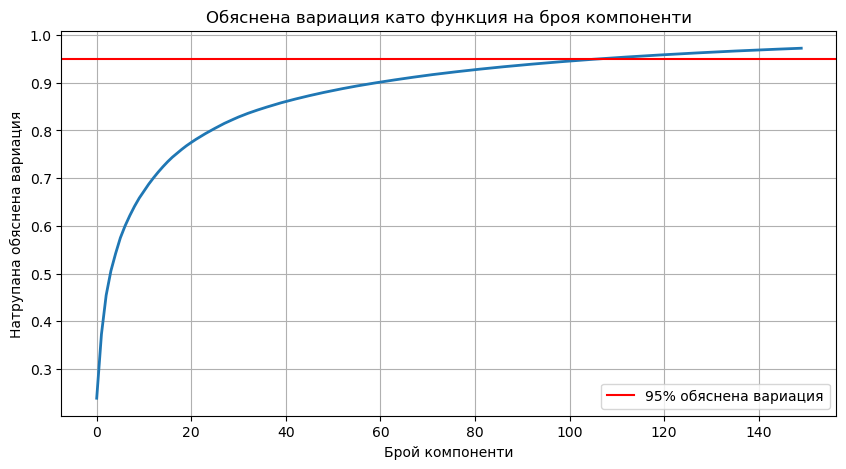

```python
import numpy as np
import matplotlib.pyplot as plt
from sklearn.datasets import fetch_olivetti_faces
from sklearn.decomposition import PCA
from sklearn.model_selection import train_test_split
from sklearn.metrics import accuracy_score
from sklearn.preprocessing import normalize

faces_dataset = fetch_olivetti_faces(shuffle=True, random_state=42)
X = faces_dataset.data
y = faces_dataset.target

n_samples, n_features = X.shape
n_classes = len(np.unique(y))
print(f"Брой изображения: {n_samples}")
print(f"Размер на изображенията: {faces_dataset.images[0].shape}")
print(f"Брой пиксели във всяко изображение: {n_features}")
print(f"Брой уникални лица (класове): {n_classes}")

def plot_gallery(images, titles, h, w, n_row=3, n_col=4):
    """Функция за визуализация на няколко изображения в решетка"""
    plt.figure(figsize=(1.8 * n_col, 2.4 * n_row))
    plt.subplots_adjust(bottom=0, left=.01, right=.99, top=.90, hspace=.35)
    for i in range(n_row * n_col):
        plt.subplot(n_row, n_col, i + 1)
        plt.imshow(images[i].reshape((h, w)), cmap=plt.cm.gray)
        plt.title(titles[i], size=12)
        plt.xticks(())
        plt.yticks(())

titles = [f"Лице {i}" for i in y[:12]]

plot_gallery(X[:12], titles, faces_dataset.images[0].shape[0], faces_dataset.images[0].shape[1])
plt.suptitle("Примерни лица от базата данни", fontsize=16)
plt.show()

X_train, X_test, y_train, y_test = train_test_split(
    X, y, test_size=0.25, random_state=42
)

n_components = 150
pca = PCA(n_components=n_components, whiten=True)
pca.fit(X_train)

eigenfaces = pca.components_.reshape((n_components, faces_dataset.images[0].shape[0], faces_dataset.images[0].shape[1]))

eigenface_titles = [f"Eigenface {i}" for i in range(eigenfaces.shape[0])]
plot_gallery(eigenfaces[:12], eigenface_titles[:12], faces_dataset.images[0].shape[0], faces_dataset.images[0].shape[1])
plt.suptitle("Първите 12 собствени лица (eigenfaces)", fontsize=16)
plt.show()

def plot_reconstruction(X, pca, n_components_list, face_index=0):
    """Функция за визуализация на реконструкцията на лица с различен брой компоненти"""
    h, w = faces_dataset.images[0].shape
    plt.figure(figsize=(15, 5))
    
    plt.subplot(1, len(n_components_list) + 1, 1)
    plt.imshow(X[face_index].reshape(h, w), cmap=plt.cm.gray)
    plt.title("Оригинал")
    plt.xticks(())
    plt.yticks(())
    
    for i, n_comp in enumerate(n_components_list):
        # Създаване на PCA с определен брой компоненти
        temp_pca = PCA(n_components=n_comp, whiten=True)
        temp_pca.fit(X_train)
        
        X_reconstructed = temp_pca.inverse_transform(temp_pca.transform([X[face_index]]))
        
        plt.subplot(1, len(n_components_list) + 1, i + 2)
        plt.imshow(X_reconstructed.reshape(h, w), cmap=plt.cm.gray)
        plt.title(f"{n_comp} компоненти")
        plt.xticks(())
        plt.yticks(())
    
    plt.suptitle("Реконструкция на лице с различен брой компоненти", fontsize=16)
    plt.show()

components_list = [10, 30, 50, 100]
plot_reconstruction(X_test, pca, components_list, face_index=0)

X_train_pca = pca.transform(X_train)
X_test_pca = pca.transform(X_test)

from sklearn.neighbors import KNeighborsClassifier

knn = KNeighborsClassifier(n_neighbors=5)
knn.fit(X_train_pca, y_train)

y_pred = knn.predict(X_test_pca)

accuracy = accuracy_score(y_test, y_pred)
print(f"Точност на класификация: {accuracy * 100:.2f}%")

plt.figure(figsize=(10, 5))
plt.plot(np.cumsum(pca.explained_variance_ratio_), linewidth=2)
plt.axis('tight')
plt.grid()
plt.xlabel('Брой компоненти')
plt.ylabel('Натрупана обяснена вариация')
plt.title('Обяснена вариация като функция на броя компоненти')
plt.axhline(y=0.95, color='r', linestyle='-', label='95% обяснена вариация')
plt.legend(loc='best')
plt.show()

def recognize_face(face_image, pca, classifier, faces_dataset):
    face_vector = face_image.reshape(1, -1)
    face_pca = pca.transform(face_vector)
    predicted_person = classifier.predict(face_pca)
    
    plt.figure(figsize=(8, 4))
    plt.subplot(1, 2, 1)
    plt.imshow(face_image.reshape(faces_dataset.images[0].shape), cmap=plt.cm.gray)
    plt.title("Входно изображение")
    plt.xticks(())
    plt.yticks(())
    
    matched_indices = np.where(y_train == predicted_person)[0]
    if len(matched_indices) > 0:
        matched_face = X_train[matched_indices[0]]
        plt.subplot(1, 2, 2)
        plt.imshow(matched_face.reshape(faces_dataset.images[0].shape), cmap=plt.cm.gray)
        plt.title(f"Разпознато като лице {predicted_person[0]}")
        plt.xticks(())
        plt.yticks(())
    
    plt.suptitle("Разпознаване на лице", fontsize=16)
    plt.show()
    
    return predicted_person[0]

# Демонстриране на разпознаването върху тестов пример
test_face_index = 10
test_face = X_test[test_face_index]
person_id = recognize_face(test_face, pca, knn, faces_dataset)
print(f"Действителна личност: {y_test[test_face_index]}, Разпозната личност: {person_id}")
```

    Брой изображения: 400
    Размер на изображенията: (64, 64)
    Брой пиксели във всяко изображение: 4096
    Брой уникални лица (класове): 40
    


    

    


    

    


    

    


    Точност на класификация: 67.00%
    


    

    


    

    


    Действителна личност: 12, Разпозната личност: 12
    


```python

```
